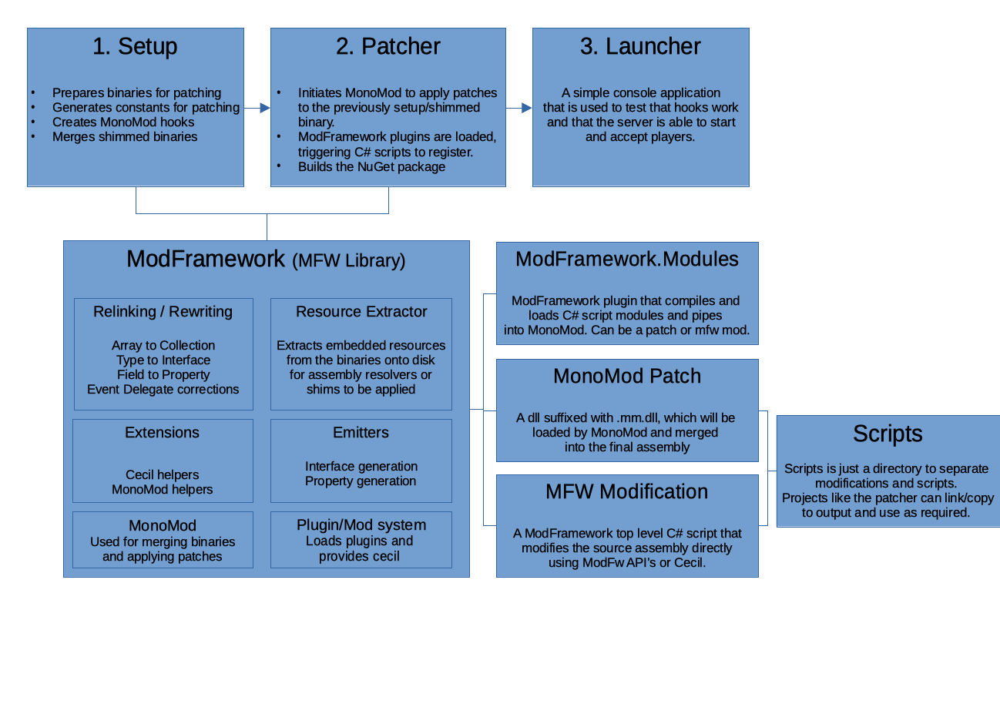

# Open Terraria API  

The Open Terraria API, known as OTAPI, is a low-level API for [Terraria](https://terraria.org) that rewrites and hooks into the official or modded binaries for others to use.

OTAPI is primarily a server modification and is available as a cross platform package via NuGet.

Version 3.0 is now a .NET5 library thanks to ModFramework being able to retarget the .NET4 vanilla assembly up to .NET5.
This means that any mod you create can be written as a .NET5 module and later merged into the patched assembly thanks to MonoMod.

Here is what is now possible:
 - Native Runtime hooks, just reference OTAPI.Runtime.dll and register to MonoMod events generated from the Terraria assembly.
 - Full .NET5 ecosystem and its performance improvements. No need for two targets such as Windows & Mono anymore either.
 - A new optional internal module system via ModFramework to load precompiled dll's, .cs files or even top level classes.
 - A strong set of libraries with methods and extensions to help you build more mods.
 - Create 1 file MonoMod patches to rewrite or inject new meta data to the assembly.

## Simple overview of v3

 

---

Bitcoin donations are welcomed via address [3PRfyMh1brjCqzkw9az2aT7yNjbfkwFZqo](bitcoin:3PRfyMh1brjCqzkw9az2aT7yNjbfkwFZqo)

